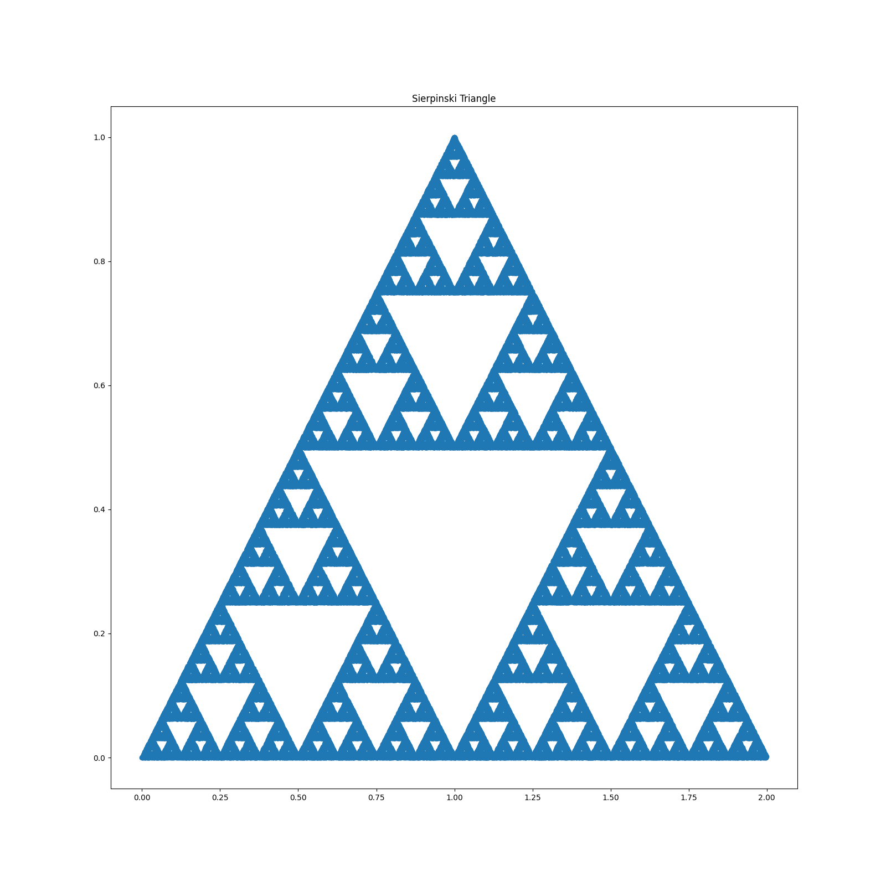

# Sierpinski-Triangle
Starting at a point e.g.  𝑝1(0,0)  , select randomly one of the three transformations and iterate for a target number of steps

Choose any of the following 3 transformations at random

## First transformation  
$$
x_{n+1} = 0.5x_{n}\\y_{n+1} = 0.5y_n
$$

## Second transformation
$$
x_{n+1} = 0.5x_n + 0.5\\y_{n+1} = 0.5y_n + 0.5
$$

## Third transformation
$$
x_{n+1} = 0.5x_n + 1\\y_{n+1} = 0.5y_n
$$

## Results

